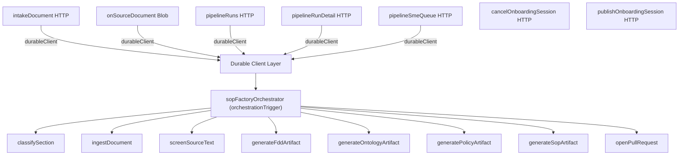

# SRE Discovery & Architecture Report: Azure Functions (DEV)

This document serves as the **SRE Current-State Discovery and Architecture Baseline** for the Azure Functions estate in the **DEV** environment. It reconciles active resource sweeps with the high-level release orchestration capability matrix to define the engineering baseline and identify operational gaps.

---

## Table of Contents

1. [Executive Summary](#1-executive-summary)
2. [Capability Matrix Update Status](#2-capability-matrix-update-status)
3. [DEV Environment Scope & Totals](#3-dev-environment-scope--totals)
4. [Azure Function App Inventory](#4-azure-function-app-inventory)
5. [Comprehensive 30-Function Mapping](#5-comprehensive-30-function-mapping)
6. [Trigger & Inbound Binding Architecture](#6-trigger--inbound-binding-architecture)
7. [System Dependencies & Data Flows](#7-system-dependencies-&-data-flows)
8. [Durable Functions (SOP Factory) Topology](#8-durable-functions-sop-factory-topology)
9. [CI/CD & Release Orchestration Audit](#9-cicd--release-orchestration-audit)
10. [Observability & Platform Settings Audits](#10-observability--platform-settings-audits)
11. [Identified Gaps & SRE Recommendations](#11-identified-gaps-&-sre-recommendations)
12. [Next Discovery Phase Roadmap](#12-next-discovery-phase-roadmap)

---

## 1. Executive Summary

This investigation was launched to resolve the **"Unknown"** status of Azure Functions across the enterprise capability matrix. Adhering to the SRE discovery workflow:
$$\text{Discover} \rightarrow \text{Verify} \rightarrow \text{Record Evidence} \rightarrow \text{Map} \rightarrow \text{Explain} \rightarrow \text{Identify Gaps} \rightarrow \text{Decide} \rightarrow \text{Implement Later}$$

We successfully sweeped the **DEV** environment resources, documenting **10 Function Apps** and **30 individual Functions**. This report translates individual API configurations into an actionable architecture topology and details security, pipeline, and observability structures.

> [!IMPORTANT]
> **No remediation or implementation changes** have been made during this discovery phase. The focus is to establish a rigorous, evidence-backed baseline.

---

## 2. Capability Matrix Update Status

The initial [Capability Matrix](file:///d:/finding%20docs/Screenshot%202026-08-23%20151834.png) marked all Azure Functions capabilities as **"Unknown"** or **"Not Started"**. Below is the updated assessment for the **DEV environment** based on our SRE audit:

| Capability Column | Previous Status | Current DEV Status | Audit Findings & Evidence |
| :--- | :--- | :--- | :--- |
| **Deploy on merge** | `unknown` | **Partially Mapped** | Mapped GitHub push workflows for `ems-plan-narration-function` and legacy `VSTSRM` Zip Deploys for `uudri` processors. |
| **Promotion gates (dev $\rightarrow$ QA $\rightarrow$ prod)** | `unknown` | **Partially Mapped** | Identified file-level split workflows for QA/PROD without immutable binary promotions or sequential pipeline triggers. |
| **Scheduled verification** | `not started` | **Not Started** | No automated integration tests or verifiers run on a schedule to validate post-release runtime health. |
| **Alerting** | `not started` | **Not Started** | No Azure Monitor Alert Rules or Action Groups are currently configured on the Function App resources. |
| **Observability + cost** | `not started` | **Partially Mapped** | Documented App Insights app settings (highlighted 1 missing app) and verified that **100%** of apps lack resource-level diagnostic settings. |
| **Reporting / audit** | `not started` | **Baseline Established** | All structural settings, triggers, and deployment history are now codified in CSV evidence datasets. |

---

## 3. DEV Environment Scope & Totals

* **Total Function Apps Swept**: 10
* **Total Registered Functions Mapped**: 30
* **Total Workflow Logic Apps Found**: 3
* **Runtime Language Breakdown**:
  * **Python (3.11/3.12)**: 5 apps / 9 functions
  * **Node.js (20)**: 2 apps / 17 functions
  * **.NET Isolated**: 3 apps / 4 functions
* **Trigger Type Breakdown**:
  * `httpTrigger`: 12
  * `activityTrigger`: 8
  * `durableClient`: 5
  * `eventHubTrigger`: 4
  * `blobTrigger`: 3
  * `serviceBusTrigger`: 1
  * `orchestrationTrigger`: 1
  * `timerTrigger`: 1

---

## 4. Azure Function App Inventory

These are the 10 Function Apps identified in the DEV resource groups:

| # | Function App Name | Resource Group | Runtime Stack | SCM Deployment Type | Always On |
| :- | :--- | :--- | :--- | :--- | :--- |
| 1 | `uudri-bill-processor-dev` | `uudri-dev-rg` | `dotnet-isolated` | `VSTSRM` | **TRUE** |
| 2 | `helios-ontology-event-processor-func` | `helios-dev-us-west3-rg` | `PYTHON\|3.11` | `None` | `FALSE` |
| 3 | `helios-github-activity-logger-dev-func` | `helios-dev-us-west3-rg` | `PYTHON\|3.11` | `None` | `FALSE` |
| 4 | `func-projector-sopfactorydevmlel9` | `helios-dev-us-west3-rg` | `NODE\|20` | `None` | `FALSE` |
| 5 | `helios-dev-cost-ingestion` | `helios-dev-us-west3-rg` | `PYTHON\|3.11` | `GitHubAction` | `FALSE` |
| 6 | `func-orchestrator-sopfactorydevmlel9` | `helios-dev-us-west3-rg` | `NODE\|20` | `None` | `FALSE` |
| 7 | `helios-device-telemetry-dev-func` | `helios-dev-us-west3-rg` | `PYTHON\|3.11` | `None` | `FALSE` |
| 8 | `ems-plan-narration-function` | `helios-dev-us-west3-rg` | `PYTHON\|3.12` | `None` | `FALSE` |
| 9 | `kg-event-processor-dev` | `helios-dev-us-west3-rg` | `dotnet-isolated` | `None` | `FALSE` |
| 10 | `UUDRI-Bill-Processor-dev-01` | `helios-dev-us-west3-rg` | `dotnet-isolated` | `VSTSRM` | **TRUE** |

---

## 5. Comprehensive 30-Function Mapping

Below is the structured listing of all 30 functions verified in DEV:

| Function App | Function Name | Language | Trigger / Inbound Binding | Connection / Target Name |
| :--- | :--- | :--- | :--- | :--- |
| `uudri-bill-processor-dev` | `BillProcessor` | `dotnet-isolated` | `blobTrigger` | `StorageAccount` |
| `helios-ontology-event-processor-func` | `health_check` | `python` | `httpTrigger` (GET) | Route: `health` |
| | `ontology_event_processor` | `python` | `eventHubTrigger` | `EventHubConnection` / `%EVENT_HUB_NAME%` |
| | `test_relationship_processor` | `python` | `httpTrigger` (POST) | Route: `test_relationship` |
| | `test_schema_processor` | `python` | `httpTrigger` (POST) | Route: `test_schema` |
| `helios-github-activity-logger-dev-func`| `github_webhook` | `python` | `httpTrigger` (POST) | Route: `github/webhook` |
| `func-projector-sopfactorydevmlel9` | `projectOnPublish` | `node` | `httpTrigger` (POST) | (Default Route) |
| `helios-dev-cost-ingestion` | `cost_ingestion` | `python` | `timerTrigger` | Schedule: `0 0 6 * * *` (Daily 6 AM) |
| `func-orchestrator-sopfactorydevmlel9` | `cancelOnboardingSession` | `node` | `httpTrigger` (POST) | Route: `v1/onboarding/{session_id}/cancel` |
| | `classifySection` | `node` | `activityTrigger` | (Durable activity) |
| | `generateFddArtifact` | `node` | `activityTrigger` | (Durable activity) |
| | `generateOntologyArtifact` | `node` | `activityTrigger` | (Durable activity) |
| | `generatePolicyArtifact` | `node` | `activityTrigger` | (Durable activity) |
| | `generateSopArtifact` | `node` | `activityTrigger` | (Durable activity) |
| | `ingestDocument` | `node` | `activityTrigger` | (Durable activity) |
| | `intakeDocument` | `node` | `httpTrigger` (POST) + `durableClient` | Route: `v1/documents` |
| | `onSourceDocument` | `node` | `blobTrigger` + `durableClient` | `SOURCE_STORAGE` |
| | `openPullRequest` | `node` | `activityTrigger` | (Durable activity) |
| | `pipelineRunDetail` | `node` | `httpTrigger` (GET) + `durableClient` | Route: `v1/pipeline/runs/{instanceId}` |
| | `pipelineRuns` | `node` | `httpTrigger` (GET) + `durableClient` | Route: `v1/pipeline/runs` |
| | `pipelineSmeQueue` | `node` | `httpTrigger` (GET) + `durableClient` | Route: `v1/pipeline/sme-queue` |
| | `publishOnboardingSession` | `node` | `httpTrigger` (POST) | Route: `v1/onboarding/{session_id}/publish` |
| | `screenSourceText` | `node` | `activityTrigger` | (Durable activity) |
| | `sopFactoryOrchestrator` | `node` | `orchestrationTrigger` | (Durable orchestrator) |
| `helios-device-telemetry-dev-func` | `new_device_and_telemetry_classification_agent` | `python` | `eventHubTrigger` | `EVENT_HUB_CONNECTION_STRING` / `%EVENT_HUB_NAME%` |
| `ems-plan-narration-function` | `plan_narration_agent` | `python` | `eventHubTrigger` | `EVENT_HUB_CONNECTION_STRING` / `%EVENT_HUB_NAME%` |
| | `realized_kpi_listener` | `python` | `eventHubTrigger` | `REALIZED_KPI_EVENT_HUB_CONNECTION_STRING` / `%REALIZED_KPI_EVENT_HUB_NAME%` |
| `kg-event-processor-dev` | `HealthCheck` | `dotnet-isolated` | `httpTrigger` (GET) | Route: `health` |
| | `ProcessDMLEvent` | `dotnet-isolated` | `serviceBusTrigger` | `SERVICEBUS_CONNECTION_STRING` (Topic: `helios-knowledgegraph-events` / Sub: `kg-event-processor`) |
| `UUDRI-Bill-Processor-dev-01` | `BillProcessor` | `dotnet-isolated` | `blobTrigger` | `StorageAccount` |

---

## 6. Trigger & Inbound Binding Architecture

Azure Functions can have complex binding patterns where one function registers multiple bindings. The total count of binding types within the DEV sweep are:

```
httpTrigger ───────────────────────────► [12]
activityTrigger ───────────────────────► [8]
durableClient ─────────────────────────► [5]
eventHubTrigger ───────────────────────► [4]
blobTrigger ───────────────────────────► [3]
serviceBusTrigger ─────────────────────► [1]
orchestrationTrigger ──────────────────► [1]
timerTrigger ──────────────────────────► [1]
```

> [!NOTE]
> Functions such as `intakeDocument`, `onSourceDocument`, and pipeline handlers register both an inbound trigger (HTTP/Blob) and a `durableClient` binding to interact with the orchestration workflow.

---

## 7. System Dependencies & Data Flows

SRE mapping exposes the runtime event-driven integrations:

### A. Event Hub Stream Group
```
                     +───────────────────+
                     |  Azure Event Hubs |
                     +─────────┬─────────+
                               │
       ┌───────────────────────┼───────────────────────┐
       ▼                       ▼                       ▼
[ontology_event_processor] [new_device_and_telemetry] [plan_narration_agent]
 (ontology-event-proc)       (device-telemetry)      (ems-plan-narration)
```
* **Listener**: `realized_kpi_listener` connects independently to Event Hub `%REALIZED_KPI_EVENT_HUB_NAME%` using `REALIZED_KPI_EVENT_HUB_CONNECTION_STRING`.

### B. Service Bus Messaging
```
[Service Bus Topic: helios-knowledgegraph-events]
                     │
                     ▼
        [Sub: kg-event-processor]
                     │
                     ▼
          [ProcessDMLEvent (Function)]
                     │
                     ▼
         (kg-event-processor-dev App)
```

### C. Storage Blobs
* **App**: `uudri-bill-processor-dev` $\rightarrow$ Triggers on `StorageAccount` blobs.
* **App**: `UUDRI-Bill-Processor-dev-01` $\rightarrow$ Triggers on `StorageAccount` blobs.
* **App**: `func-orchestrator-sopfactorydevmlel9` $\rightarrow$ `onSourceDocument` triggers on `SOURCE_STORAGE` blobs.

---

## 8. Durable Functions (SOP Factory) Topology

The `func-orchestrator-sopfactorydevmlel9` is the core workflow engine. Below is its operational execution topology:



---

## 9. CI/CD & Release Orchestration Audit

Repository Analyzed: [`qcells-hqct / helios-plan-narration-backend`](file:///d:/finding%20docs/SRE_DEV_Discovery_Documentation.md#L400)

### Release Sequence:
1. **GitHub Push / Workflow Dispatch**: Triggers workflow `.github/workflows/deploy-function-app.yml`.
2. **CI Phase**: Runs `pip install` and `python -m compileall`. 
   > [!WARNING]
   > The deployment workflow **does not** run `pytest` tests; they are isolated in `test-function-app.yml` and are not a deployment blocker.
3. **CD Phase**: Performs `azure/login` using repository secrets, sets app settings, and deploys using `azure/functions-action` (ZipDeploy targeting `ems-plan-narration-function`).
4. **Validation**: Runs basic state registration checks.

### Identified CI/CD Risks (SRE Perspective):
* **No promotion chain**: Environments (DEV, QA, PROD) run on decoupled GitHub workflows instead of sequential promotion.
* **No immutable builds**: Build artifacts are compiled dynamically in each run instead of building once and promoting the same binary.
* **Missing rollback mechanism**: Failures during post-deploy validation do not trigger automatic rollbacks.

---

## 10. Observability & Platform Settings Audits

### A. Observability Baseline

| Function App | App Insights Conn | Legacy Instru Key | Azure Monitor Diagnostic Settings |
| :--- | :---: | :---: | :---: |
| `uudri-bill-processor-dev` | **Present** | Missing | **None (0)** |
| `helios-ontology-event-processor-func` | **Present** | **Present** | **None (0)** |
| `helios-github-activity-logger-dev-func`| **Present** | **Present** | **None (0)** |
| `func-projector-sopfactorydevmlel9` | **Present** | Missing | **None (0)** |
| `helios-dev-cost-ingestion` | **Missing** | **Missing** | **None (0)** |
| `func-orchestrator-sopfactorydevmlel9` | **Present** | Missing | **None (0)** |
| `helios-device-telemetry-dev-func` | **Present** | Missing | **None (0)** |
| `ems-plan-narration-function` | **Present** | **Present** | **None (0)** |
| `kg-event-processor-dev` | **Present** | **Present** | **None (0)** |
| `UUDRI-Bill-Processor-dev-01` | **Present** | **Present** | **None (0)** |

### B. SCM & Web Configuration Settings

All swept apps share these settings:
* **Min TLS Version**: `1.2`
* **Public Network Access**: `Enabled`

Specific app config anomalies:
* **AlwaysOn**: Enabled *only* on `uudri-bill-processor-dev` and `UUDRI-Bill-Processor-dev-01` (running dotnet-isolated).
* **FTPS State**: 
  * `FtpsOnly`: Enforced on `uudri-bill-processor-dev`, `helios-ontology-event-processor-func`, `ems-plan-narration-function`, and `kg-event-processor-dev`.
  * `Disabled`: Configured on all other 6 apps.

---

## 11. Identified Gaps & SRE Recommendations

Based on our DEV discovery, we have identified these major operational risks:

> [!CAUTION]
> ### Critical Observability Gaps
> 1. **Complete Observability Blind Spot**: `helios-dev-cost-ingestion` has neither App Insights Connection String nor Instrumentation Key configured. Its executions, performance, and failures are completely unmonitored.
> 2. **Azure Monitor Logs Deficit**: **100%** of DEV Function Apps lack resource-level diagnostic settings. Audit, platform, and scaling logs are not piped to Log Analytics workspaces or Event Hubs.

> [!WARNING]
> ### Release Pipeline Risks
> 1. **Untested Deployments**: The lack of integration test dependencies (`pytest`) in the deploy workflow introduces risk of deploying syntactically correct but functionally broken code.
> 2. **Environment Configuration Drift**: Decoupled workflow files for DEV, QA, and PROD make it highly susceptible to environment configuration drift.

---

## 12. Next Discovery Phase Roadmap

To transition the Capability Matrix from **Partially Mapped** to **Completed**, SRE must execute the next discovery sequence:

```
[Phase 2.1: Identity & RBAC] ──► Audit Managed Identity permissions for Storage, Event Hubs, and Key Vault.
             │
             ▼
[Phase 2.2: Networking]      ──► Verify VNet integration and private endpoint boundaries.
             │
             ▼
[Phase 2.3: Alerting]        ──► Map existing Application Insights resource alert rules & action groups.
             │
             ▼
[Phase 2.4: SLO & Operations]──► Define SLIs/SLOs, map run-rate failure rates, and establish ownership matrices.
```

---
*Evidence verified and recorded by SRE team on 2026-08-23.*
